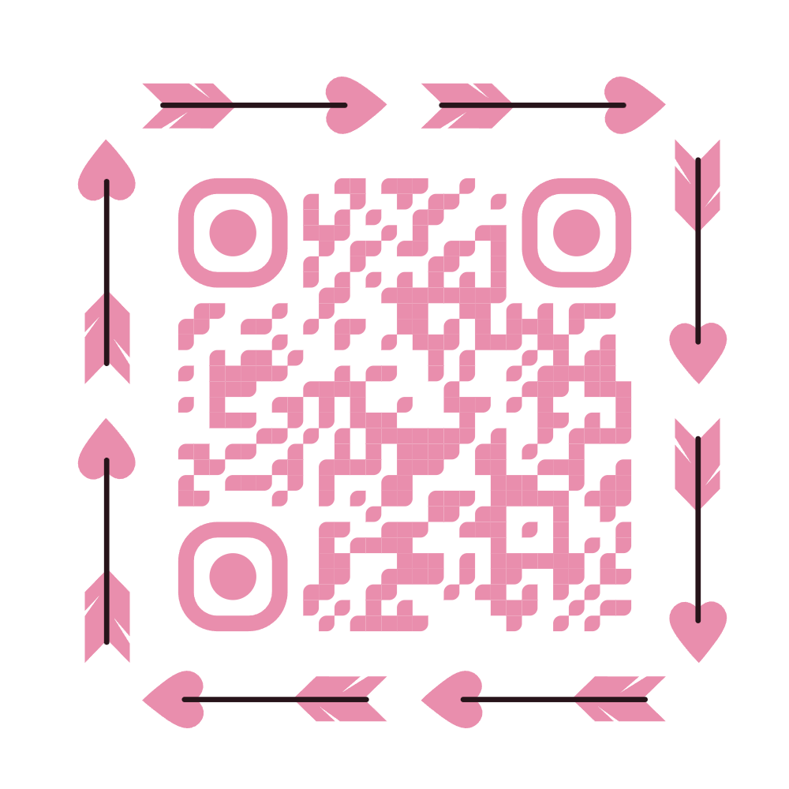
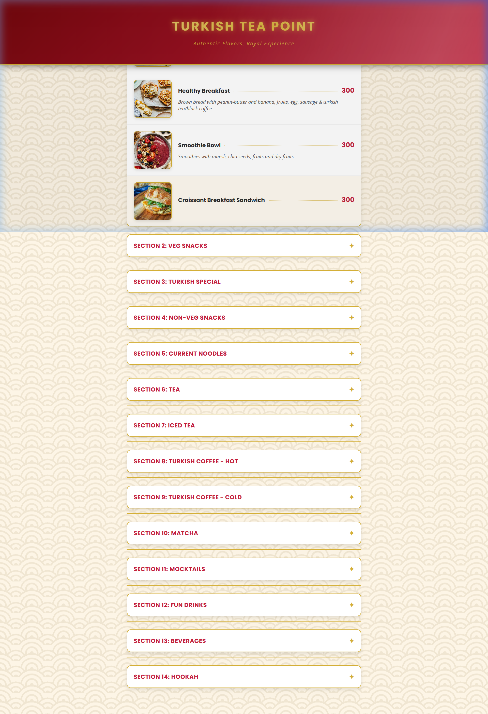

# 🍵 Turkish Tea Point - Digital Menu

Welcome to the **Turkish Tea Point** Digital Menu! This project provides an interactive and visually appealing way for customers to explore our authentic flavors, ranging from traditional Turkish breakfast to refreshing mocktails and hookahs.

## 🚀 Live Preview
Scan the QR code below to view the menu on your mobile device:

*Or visit the live link:*
[View Digital Menu](https://stalwart-licorice-556ede.netlify.app/)

---

## ✨ Features
- **Responsive Design**: Works perfectly on mobile phones and tablets.
- **Categorized Sections**: Easy navigation through Breakfasts, Veg/Non-Veg Snacks, Turkish Specials, Teas, Coffees, and more.
- **Rich Visuals**: High-quality images for every item to enhance the customer experience.
- **Interactive UI**: Accordion-style layout for a clean and modern look.

## 🍽️ Menu Categories
1. **Breakfasts**: Gilber (Turkish Eggs), Healthy Breakfast, Smoothie Bowls.
2. **Turkish Specials**: Mercimek Köftesi, Paneer Shashlik, Creamy Turkish Chicken.
3. **Drinks**: Turkish Tea, Specialty Coffees, Matcha, Mocktails, and Lassi.
4. **Snacks**: Burgers, Rolls, Sandwiches, and Pizza.
5. **Hookah**: Cloud, Milk Base, and Special blends.

## 🛠️ Built With
- **HTML5**: For semantic structure.
- **Vanilla CSS**: Custom styling with a premium "Royal" aesthetic.
- **JavaScript**: For interactive accordion functionality.

---

## 📸 Screenshots

---

### 👨‍💻 Developer
Developed with ❤️ for **Turkish Tea Point**.
